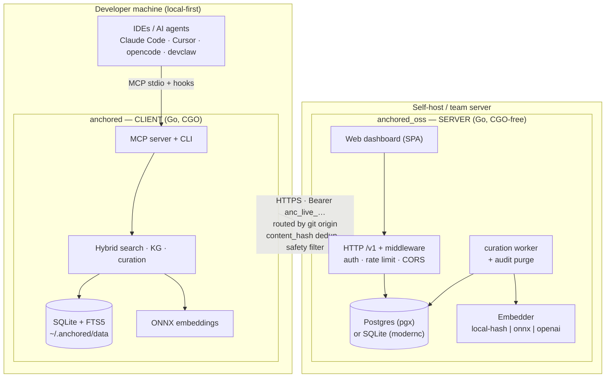
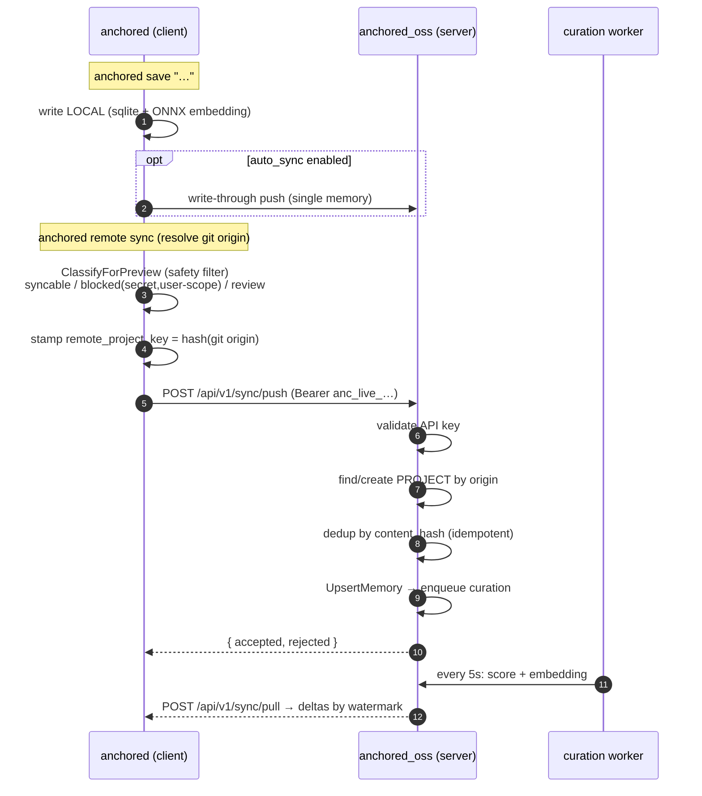
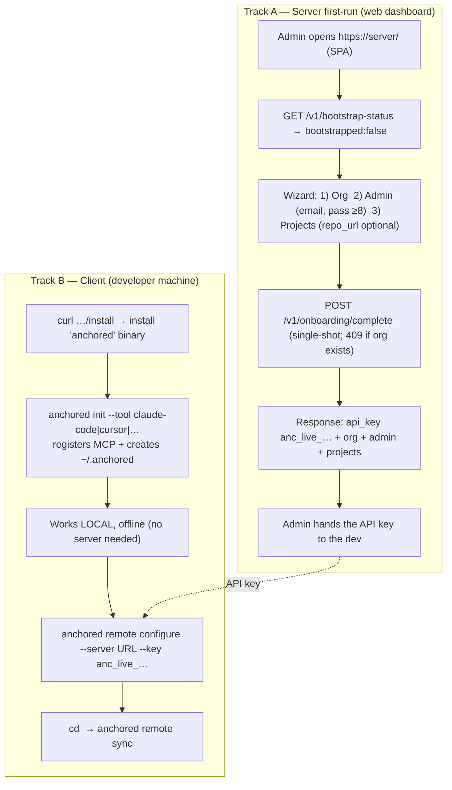

# Anchored — Architecture

Anchored is a **persistent, cross-tool memory layer for AI coding agents**. It has two
components:

- **`anchored` (client)** — a local-first MCP server + CLI that every IDE / AI tool
  talks to. It owns the memory on your machine and works fully **offline**.
- **`anchored_oss` (server)** — an optional, self-hostable control plane that lets
  memories be **shared across machines and teams**, with a web dashboard for
  identity, projects, policy and audit.

The client is the source of truth on each machine; the server is **opt-in** and
joined per-repository by its **git origin**.

---

## 1. System overview

```
        ┌──────────────────────────────────────────────────────────────────┐
        │                       DEVELOPER MACHINE (local-first)              │
        │   IDEs / AI agents (Claude Code, Cursor, opencode, devclaw …)      │
        │        │  MCP (stdio)  +  hooks (SessionStart / UserPromptSubmit)  │
        │        ▼                                                           │
        │   ┌─────────────────────────  anchored (CLIENT)  ──────────────┐  │
        │   │  Go · CGO · MCP server + CLI                               │  │
        │   │  SQLite (FTS5) + ONNX embeddings → ~/.anchored/data/*.db   │  │
        │   │  Hybrid search · Knowledge Graph · dream/curation          │  │
        │   └──────────────────────────────┬─────────────────────────────┘  │
        └──────────────────────────────────┼────────────────────────────────┘
                                            │  HTTPS (opt-in)
                       Bearer API key (anc_live_…) · routed by git origin
                       push/pull · content_hash dedup · safety filter
                                            ▼
        ┌───────────────────────────────────────────────────────────────────┐
        │                    SERVER (self-host / team)                        │
        │   ┌─────────────────────────  anchored_oss  ─────────────────────┐  │
        │   │  Go · CGO-free static · HTTP /v1                            │  │
        │   │  Postgres (pgx) | SQLite (modernc)                         │  │
        │   │  Web dashboard (SPA) · curation worker · audit purge       │  │
        │   │  Identity/Orgs/Teams/API-keys · Projects · Policy          │  │
        │   │  Embedder: local-hash | onnx | openai                      │  │
        │   └─────────────────────────────────────────────────────────────┘  │
        └─────────────────────────────────────────────────────────────────────┘
```



---

## 2. `anchored` — client internals

```
anchored (cmd/anchored)
├─ serve            MCP server (STDIO) for the IDEs
├─ CLI              save · search · list · forget · update · inspect · stats · export
├─ init / doctor    register the MCP server in tools, diagnose install
├─ hooks            sessionstart · userpromptsubmit · precompact · handoff
├─ dream / curation consolidate duplicates, score signal
└─ remote           configure · sync · status · preview · link / unlink

pkg/
├─ memory     SQLite + HYBRID search
│               • vector (cosine, int8) + BM25 (FTS5) → score-aware fusion
│               • category-aware temporal decay · MMR semantic dedup
│               • save-time dedup by normalized equality
│               • FTS5 tokenizer unicode61 remove_diacritics (multilingual)
├─ mcp        anchored_* tools + <anchored_context> injection (KG + fencing)
├─ kg         knowledge graph (subject / predicate / object triples)
├─ context    context optimizer / sandbox (execute / read)
├─ sync       HTTP client (Bearer) + classification / safety filter
├─ session    cross-session continuity
└─ config     ~/.anchored/config + remote settings
```

## 3. `anchored_oss` — server internals

```
cmd/server/main.go
├─ -setup        interactive wizard (configures the DB only)
├─ -bootstrap    create org + admin + API key (headless first-run)
├─ -reindex      backfill embeddings for the whole corpus
└─ runtime:      HTTP server + curation worker + audit purge (goroutines)

internal/
├─ server     /v1 routes (Go ServeMux) + middleware (auth, rate limit, CORS)
├─ handler    auth · me · stats · accounts · teams · api-keys · projects ·
│             audit · quota · policy · chat · sync · memories · onboarding · health
├─ store      Store interface with TWO implementations:
│               • Postgres (pgx)      postgres.go / *.go
│               • SQLite  (modernc)   sqlite_*.go
├─ sync       push/pull engine + compat endpoints (/api/v1/sync/*)
├─ curation   worker: scores + embeds synced memories (5s tick)
├─ ai/embeddings  local-hash | onnx | openai (shared, injected)
├─ ai/chat    /v1/chat (configurable provider)
├─ policy     content filter / per-org guardrails
├─ project    derive remote_key from git origin
└─ web        embedded SPA dashboard (dist) + /install scripts
```

---

## 4. Sync flow (the two connected)



**Guarantees:** `content_hash` keeps sync idempotent (re-push never duplicates), and
secret / user-scope memories never leave the machine (safety filter redacts/blocks).

---

## 5. Onboarding flow



> Headless alternative to Track A: `anchored-oss -bootstrap` (or `-setup`) creates the
> org/admin/key from the terminal.

**The link between the two is the API key + the git origin.** The key authenticates;
the git origin decides which remote project a repo's memories land in (same origin on
different machines → same project).

---

## 6. Feature list

### Client `anchored`
- **Local-first memory**: save / search / list / update / forget / inspect / export / stats.
- **Hybrid search**: vector + BM25 with score-aware fusion, category-aware decay, MMR
  semantic dedup, multilingual tokenizer (diacritic folding).
- **Smart save**: categorization, dedup by normalized equality, scope (user/project/team).
- **MCP + auto-use**: `anchored_*` tools, `<anchored_context>` injection (identity +
  project + recents + KG, fenced as data-not-instructions), always-on pre-search,
  per-turn reminder.
- **Knowledge Graph**: `anchored_kg_add` / `anchored_kg_query` (triples).
- **Continuity**: SessionStart / UserPromptSubmit / PreCompact hooks, handoff snapshots.
- **Maintenance**: dream/curation (consolidate duplicates), retention sweep, import
  (claude-code / cursor / opencode / devclaw).
- **Opt-in sync**: configure / sync / status / preview / link / unlink, routed by git
  origin, safety filter before anything leaves the machine.

### Server `anchored_oss`
- **Identity & access**: orgs, accounts, teams, members, API keys (admin/readonly
  scopes), login, invites.
- **Projects**: creation, listing by team access, `remote_key` from git origin (or
  manual via repo_url), soft-delete.
- **Memories**: ingest via sync, **text** and **semantic** (vector KNN) search per project.
- **Sync**: canonical `/v1/sync` + compat `/api/v1/sync/{push,pull}`, content_hash dedup,
  watermark deltas.
- **Governance**: per-org policy/guardrails (blocked categories, thresholds), storage
  quota, **audit log** with retention purge.
- **Embeddings**: configurable provider (local-hash / onnx / openai), async curation
  worker, `-reindex` backfill.
- **Chat**: `/v1/chat` (+ status) with configurable provider.
- **Web dashboard (SPA)**: stats, accounts, teams, api-keys, projects, graph, policy,
  audit, onboarding.
- **Operations**: static CGO-free build, Postgres **or** SQLite, rate limiting, CORS,
  `/v1/health`, `/install`.

### Protocol / connection
- Auth: `Authorization: Bearer anc_live_…`.
- Routing by **git origin** (repo identity, not the folder name).
- **content_hash** byte-identical across versions → dedup + backward compatibility.
- Safety filter: secret / PII / user-scope memories never sync; content is sanitized.

---

## 7. Build & runtime notes

| | `anchored` (client) | `anchored_oss` (server) |
|---|---|---|
| Language | Go | Go |
| CGO | **Required** (`CGO_ENABLED=1`) | **Off** (`CGO_ENABLED=0`, static) |
| SQLite driver | `mattn/go-sqlite3` (FTS5) | `modernc.org/sqlite` (pure-Go) |
| Build flags | `CGO_CFLAGS="-DSQLITE_ENABLE_FTS5" CGO_LDFLAGS="-lm"` | — |
| Primary store | SQLite (per-machine) | Postgres (pgx) or SQLite |
| Embeddings | ONNX (multilingual MiniLM, 384-d) | local-hash / onnx / openai |

> SQLite-driver note (server): `modernc.org/sqlite` returns `DATETIME` columns as Go
> strings. Every SQLite read path that scans a timestamp must wrap the destination with
> `scanTime` / `scanNullTime` (`internal/store/sqlite_helpers.go`); scanning directly
> into `*time.Time` works on Postgres but panics on SQLite.
